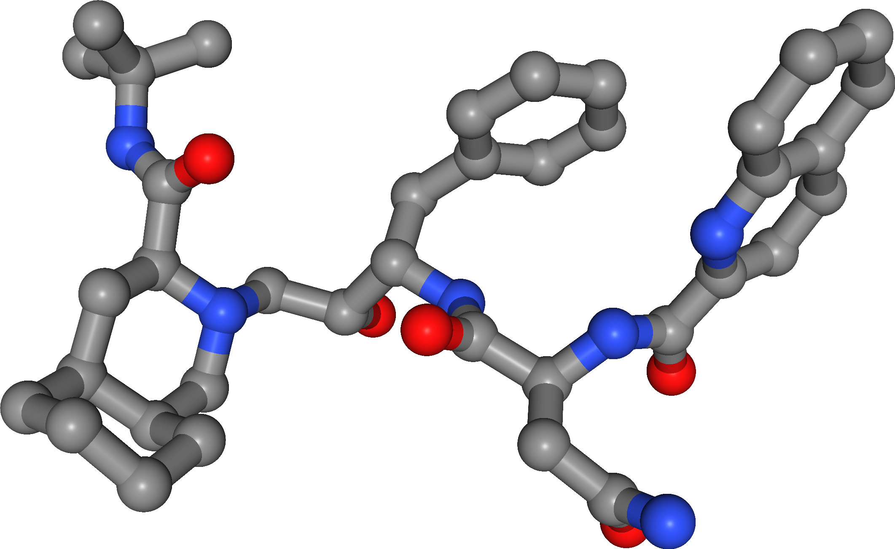

# HIV-1 Protease Molecular Docking and Molecular Dynamics Simulation

Molecular docking is a computational technique used to predict the binding mode of a ligand to a protein target.
It is a crucial step in drug discovery, as it can help identify potential drug candidates.
This repository contains files needed to perform molecular docking and molecular dynamics simulations on a dataset of ligands against a protein target.
Around two thousand ligands were docked against the [HIV-1 protease variant G48T/L89M](https://www.rcsb.org/structure/4qgi) protein (seen below).

**HIV-1 protease** is an enzyme that plays a crucial role in the replication of the human immunodeficiency virus (HIV).
It cleaves the newly synthesized polyproteins at into mature protein components of an HIV viron, the infectious form of a virus outside the host cell.

The docking was performed using [QuickVina](https://github.com/QVina) and the ligand with the best fit was selected for molecular dynamics simulation done using [Gromacs](https://github.com/gromacs).
The simulation was carried a second time, this time with [Saquinavir](https://en.wikipedia.org/wiki/Saquinavir) (seen below), a known inhibitor of the HIV-1 protease. 

Both simulations were compared in terms of their Root-Mean-Square Deviation (RMSD) and other properties to determine the quality of the fit and the potential of the new ligand as a drug candidate.

For more information, please refer to the [report](report/report.pdf).

### Possible future work

- Test mutated protease to see if the Saquinavir inhibitor binds.

### References

- [QuickVina](https://github.com/QVina) for molecular docking
- [Gromacs](https://github.com/gromacs) for MD simulations
- [NGLView](https://github.com/nglviewer) for visualizations
- [RCSB](https://www.rcsb.org/structure/4qgi) to download HIV-1 protease variant G48T/L89M complexed with Saquinavir
